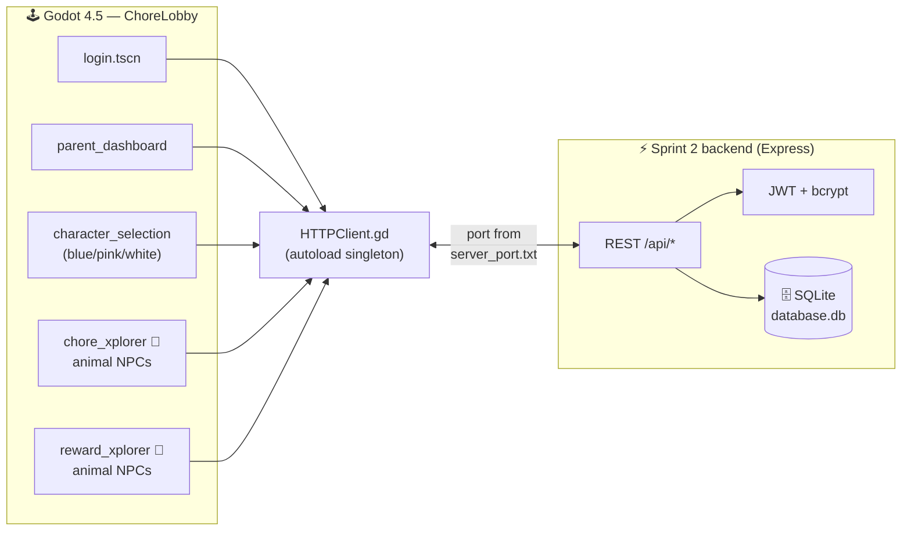
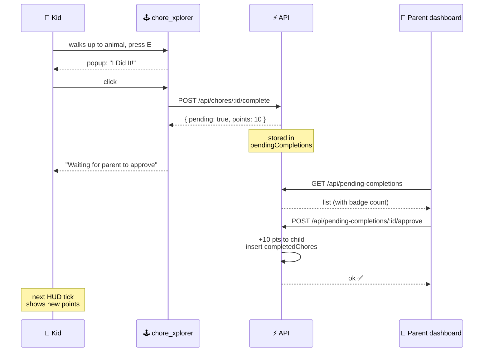
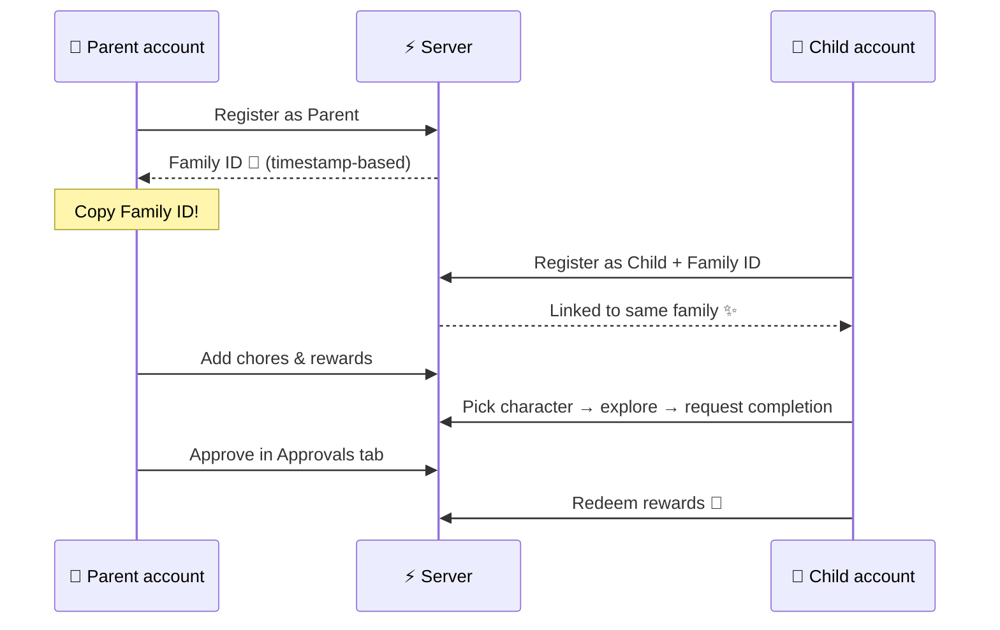
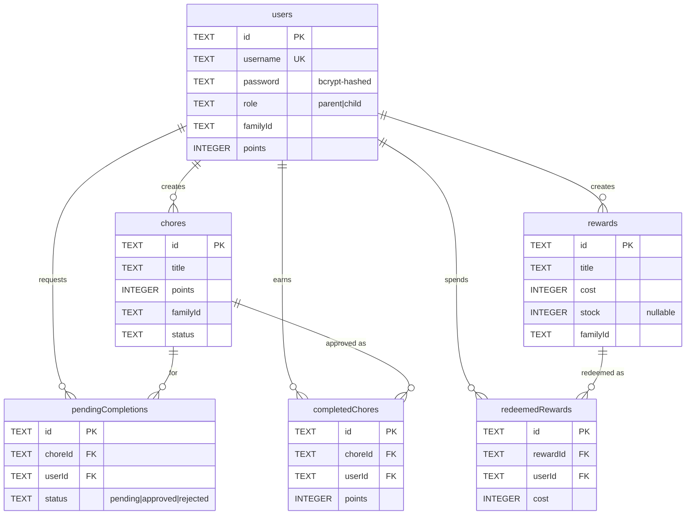

<div align="center">

```
 ██████╗ ██╗  ██╗ ██████╗ ██████╗ ███████╗    ██╗      ██████╗ ██████╗ ██████╗ ██╗   ██╗
██╔════╝ ██║  ██║██╔═══██╗██╔══██╗██╔════╝    ██║     ██╔═══██╗██╔══██╗██╔══██╗╚██╗ ██╔╝
██║      ███████║██║   ██║██████╔╝█████╗      ██║     ██║   ██║██████╔╝██████╔╝ ╚████╔╝ 
██║      ██╔══██║██║   ██║██╔═══╝ ██╔══╝      ██║     ██║   ██║██╔══██╗██╔══██╗  ╚██╔╝  
╚██████╗ ██║  ██║╚██████╔╝██║     ███████╗    ███████╗╚██████╔╝██████╔╝██████╔╝   ██║   
 ╚═════╝ ╚═╝  ╚═╝ ╚═════╝ ╚═╝     ╚══════╝    ╚══════╝ ╚═════╝ ╚═════╝ ╚═════╝    ╚═╝   
```

# **Parapest** · *ChoreLobby*

### Turn chores into quests. Turn rewards into loot. 🗡️🎁

[](https://godotengine.org/)
[](https://nodejs.org/)
[](https://www.sqlite.org/)
[](https://jwt.io/)
[]()

*A pixel-art chore & reward game for families — parents run the kingdom, kids explore the forest.*

</div>

---

## 🎮 What is this?

> **30-second pitch:** Parents type chores into a dashboard. Kids see those chores as **little animals scattered around a parallax-scrolling forest**. Walk up, press `E`, "I Did It!", parent approves, points appear, kid trades points for rewards. That's it. That's the game.

<table>
<tr>
<td width="50%" valign="top">

### 👨‍👩‍👧 Parent side
*A tidy dashboard. Glassmorphism. No drama.*

- Make chores
- Make rewards
- **Approve** what the kids claim they did
- Watch points & history scroll by

</td>
<td width="50%" valign="top">

### 👶 Kid side
*A side-scrolling forest with animal NPCs.*

- Pick a hero (blue / pink / white)
- Roam the forest
- Find an animal → press `E` → see the chore
- Earn points → spend them in the reward biome

</td>
</tr>
</table>

> ⚠️ **Heads up:** Older docs (`PROJECT_SUMMARY.md`, `QUICKSTART.md`, parts of `FEATURES.md`, `TROUBLESHOOTING.md`) still reference a React/Vite web app from a previous life.
> **The real stack today: Godot 4.5 client + Node/Express + SQLite.** Trust this README first.

---

## 🆕 What's new since the last update

| | Change | Where |
|---|---|---|
| 🛂 | **Pending-approval workflow** — kids request, parents approve/reject, points only land after approval | `parent_dashboard.gd` (Approvals tab) |
| 🐻 | **Animal NPCs** — chores & rewards spawn as 6 different animal sprites at hand-picked forest positions | `chore_avatar.gd`, `reward_avatar.gd` |
| 🦸 | **Character selection** with run-in + punch + idle entrance tween | `character_selection.gd` |
| 🌲 | **4-layer parallax backgrounds** in login & character select | `login.gd`, `MainMenu.gd` |
| 💬 | **Dynamic popup UI** for chores/rewards (no more pre-built scene popups) | `chore_xplorer.gd`, `reward_xplorer.gd` |
| ⚡ | **Auto-start backend** on game launch + auto-port discovery (49152→…) | `HTTPClient.gd` + `server.js` |
| 🗑️ | **Optimistic deletes** so the UI snaps instantly, rolls back on failure | `parent_dashboard.gd` |
| 🗄️ | **SQLite swap** (was JSON file). WAL-mode, indexed. | `Sprint 2 backend/server.js` |
| 🎨 | **Glassmorphism cards** in the parent dashboard | `parent_dashboard.gd` |

---

## 🗺️ How it all wires up



---

## 🎬 The flows that matter

### 🛂 Pending-approval loop (the new heart of the game)



### 🦸 First family setup



---

## ✨ Feature loot table

<details open>
<summary><b>👨‍👩‍👧 Parent powers</b></summary>

| | Feature | Notes |
|:---:|:---|:---|
| 📋 | **Chores CRUD** | Title, description, points |
| 🎁 | **Rewards CRUD** | Title, description, cost — `stock` field in schema |
| 🛂 | **Approvals tab** | Live badge count: `Approvals (3)` |
| ✅ | **Approve / Reject** | Points only awarded on approve |
| 👨‍👩‍👧‍👦 | **Family view** | Roles + live point balances |
| 📜 | **History** | Completed chores + redeemed rewards, newest first |
| 💨 | **Optimistic delete** | UI removes instantly, rolls back on server error |
| 🌌 | **Glassmorphism UI** | Translucent cards, subtle shadows, accent borders |

</details>

<details open>
<summary><b>👶 Kid adventure mode</b></summary>

| | Feature | Notes |
|:---:|:---|:---|
| 🦸 | **Character select** | Blue, Pink, or White — with cinematic run-in + punch entrance |
| 🌲 | **Chore Explorer** | Side-scrolling forest, 57 hand-picked spawn points |
| 🐻 | **Animal NPCs** | 6 sprite types: bear, mouse, wolf, snake (+ variants) |
| 💡 | **Press-E hint** | Floats above an animal when you're in range |
| 🎁 | **Reward Explorer** | Mirrored map; can the points cover the cost? |
| 💰 | **Live points HUD** | Polls server every 1s, also reads `/api/family` |
| ⏸️ | **Pause menu** | ESC freezes the world, doesn't block popups |

</details>

---

## 🎭 The cast

<table>
<tr>
<th>🦸 Playable heroes</th>
<th>🐾 Animal NPCs (chore/reward markers)</th>
</tr>
<tr>
<td valign="top">

| | Name | Scene |
|:---:|:---|:---|
| 🔵 | Blue | `bluePlayer.tscn` |
| 🩷 | Pink | `pinkPlayer.tscn` |
| ⚪ | White | `whitePlayer.tscn` |

*Each has idle / run / attack / fall animations.*

</td>
<td valign="top">

| # | Animal | Used as |
|:---:|:---|:---|
| 0 | 🐻 Bear | chore/reward marker |
| 1 | 🐭 Mouse | chore/reward marker |
| 2 | 🐺 Wolf | chore/reward marker |
| 3 | 🐍 Snake | chore/reward marker |
| 4 | 🐍 Snake (alt) | chore/reward marker |
| 5 | 🐻 Bear (alt) | chore/reward marker |

*Sprites from `Assets/spritesheet.png`, picked by `i % 6`.*

</td>
</tr>
</table>

---

## 🕹️ Controls (kid worlds)

```
        ╔══════════╗
        ║   W / ↑  ║   ← jump
   ╔════╩══════════╩════╗
   ║  A / ←    D / →    ║   ← move
   ╚════════════════════╝
        Shift  ← run
        E / Q  ← interact (also closes popup)
        Esc    ← pause (or close popup first)
        ← →    ← browse all chores/rewards in popup
```

| Key | Action |
|:---:|:---|
| `W` `A` `S` `D` / arrows | Move |
| `Space` / `↑` / `W` | Jump |
| `Shift` | Run |
| `E` / `Q` | Interact / close popup |
| `← →` | Browse chores/rewards (when "View Chores" popup is open) |
| `Esc` | Pause menu (or close popup first) |

---

## 🚀 Quick start (~5 min)

### Requirements

| Tool | Version | Why |
|:---|:---:|:---|
| [Godot](https://godotengine.org/download) | **4.5** | Game client |
| [Node.js](https://nodejs.org/) | **16+** | Backend API |
| npm | latest | Install deps |

### 1️⃣ Backend

```powershell
cd "Sprint 2 backend"
npm install
npm start
```

You should see something like:

```
Database initialized
Server running on port 49152
Using SQLite database: …/database.db
Port written to …/server_port.txt
```

> 🪟 Windows install drama (sqlite3 build errors etc.)? Try `Sprint 2 backend/INSTALL.md`, `QUICK_FIX.md`, `FIX_SDK.md`, or `SETUP_WINDOWS.md`.

### 2️⃣ Godot client

1. Open this repo folder in **Godot 4.5**
2. Press **F5** (Play)

> 💡 **Pro tip:** `HTTPClient.gd` will **auto-launch the backend** for you on game start (`npm run dev`). If it's already running on a different port, the game reads `server_port.txt` to find it. So in practice you can usually skip step 1️⃣.

### 3️⃣ First family setup

| Step | Who | Do this |
|:---:|:---:|:---|
| 1 | 👨 Parent | Register → save your **Family ID** |
| 2 | 👶 Child | Register with that **Family ID** |
| 3 | 👨 Parent | Add a chore (+ points) and a reward |
| 4 | 👶 Child | Login → pick character → explore & "I Did It!" |
| 5 | 👨 Parent | Open **Approvals** tab → Approve ✅ |
| 6 | 👶 Child | Hit Reward Explorer when points are enough 💸 |

---

## 🔌 API snapshot

**Base URL:** `http://localhost:49152` *(default — actual port is in `Sprint 2 backend/server_port.txt`)*

<table>
<tr><th>Auth</th><th>Chores</th><th>Approval flow</th><th>Rewards</th><th>Family</th></tr>
<tr valign="top">
<td>

| Verb | Route |
|:---:|:---|
| `POST` | `/api/register` |
| `POST` | `/api/login` |
| `POST` | `/api/logout` |
| `GET`  | `/api/user` |

</td>
<td>

| Verb | Route |
|:---:|:---|
| `GET`    | `/api/chores` |
| `POST`   | `/api/chores` 🔒 |
| `PUT`    | `/api/chores/:id` 🔒 |
| `DELETE` | `/api/chores/:id` 🔒 |
| `GET`    | `/api/completed-chores` |

</td>
<td>

| Verb | Route |
|:---:|:---|
| `POST` | `/api/chores/:id/complete` 👶 |
| `GET`  | `/api/pending-completions` |
| `POST` | `/api/pending-completions/:id/approve` 🔒 |
| `POST` | `/api/pending-completions/:id/reject` 🔒 |

</td>
<td>

| Verb | Route |
|:---:|:---|
| `GET`    | `/api/rewards` |
| `POST`   | `/api/rewards` 🔒 |
| `PUT`    | `/api/rewards/:id` 🔒 |
| `DELETE` | `/api/rewards/:id` 🔒 |
| `POST`   | `/api/rewards/:id/redeem` 👶 |
| `GET`    | `/api/redeemed-rewards` |

</td>
<td>

| Verb | Route |
|:---:|:---|
| `GET` | `/api/family` |

🔒 = parent-only<br/>
👶 = child-only<br/>
*(rest = any authed user)*

</td>
</tr>
</table>

Source of truth: [`Sprint 2 backend/server.js`](Sprint%202%20backend/server.js)

---

## 🗄️ Database schema (SQLite)



---

## 📁 Repo map

```
Parapest/
│
├── 🎮  GODOT CLIENT (root)
│   ├── project.godot            # Engine config — "ChoreLobby"
│   ├── HTTPClient.gd            # Autoload: API bridge + auto-boots backend
│   │
│   ├── 🪪  Auth & menus
│   │   ├── login.tscn / .gd     # Combined login + register UI (parent/child)
│   │   ├── MainMenu.tscn / .gd  # Legacy menu w/ parallax bg
│   │   └── parent_login.tscn    # (older flow, still around)
│   │
│   ├── 🏠  Parent
│   │   └── parent_dashboard.tscn / .gd
│   │       ↳ tabs: Chores | Rewards | Approvals | Family | History
│   │
│   ├── 🦸  Kid
│   │   ├── character_selection.tscn / .gd  # Run-in entrance animation
│   │   ├── chore_xplorer.tscn / .gd        # Forest level w/ animal NPCs
│   │   ├── reward_xplorer.tscn / .gd       # Mirrored forest, redeem here
│   │   ├── chore_avatar.tscn / .gd         # An animal that pops a chore
│   │   └── reward_avatar.tscn / .gd        # An animal that pops a reward
│   │
│   ├── characters/                          # Playable + interface sprites
│   │   ├── {blue,pink,white}Player.tscn
│   │   ├── Player.gd                        # Shared movement/animation
│   │   └── Interface_animals/               # NPC variants (bear/wolf/snake/mouse)
│   │
│   └── Assets/                              # Pixel forests, heroes, FX, frogs 🐸
│
├── ⚡  Sprint 2 backend/
│   ├── server.js                # Express + SQLite + JWT
│   ├── database.db              # Auto-created
│   ├── server_port.txt          # Written at startup, read by Godot
│   ├── package.json
│   └── *.md                     # Install / quick-fix notes (Windows)
│
└── 📚 Legacy docs (React era — outdated)
    ├── FEATURES.md          ⚠️
    ├── QUICKSTART.md        ⚠️
    ├── PROJECT_SUMMARY.md   ⚠️
    └── TROUBLESHOOTING.md   ⚠️ (some sections still ok)
```

---

## 🛠️ Dev cheat sheet

| Task | Command / action |
|:---|:---|
| Run API only | `cd "Sprint 2 backend" && npm start` |
| API w/ hot reload | `npm run dev` *(nodemon)* |
| Run game | Open in Godot 4.5 → **F5** |
| Reset DB | Delete `Sprint 2 backend/database.db` *(and `.db-wal`/`.db-shm`)*, restart server |
| Find current port | `cat Sprint 2 backend/server_port.txt` |
| Tail server logs | The cmd window Godot spawned is the server's stdout |

**Optional `.env`** in `Sprint 2 backend/`:

```env
PORT=49152
JWT_SECRET=change-me-in-production
```

---

## 🐛 Something broke?

| Symptom | Try |
|:---|:---|
| 😶 Can't login / "Connection error" | Is the backend up? Check Godot's **Output** panel for `HTTPClient:` lines. |
| 🔢 Wrong port | `server_port.txt` is the truth; Godot reads it on startup. Restart the game so it re-reads. |
| 💥 `npm install` fails on Windows (sqlite3) | [`INSTALL.md`](Sprint%202%20backend/INSTALL.md), [`QUICK_FIX.md`](Sprint%202%20backend/QUICK_FIX.md), [`FIX_SDK.md`](Sprint%202%20backend/FIX_SDK.md), [`SETUP_WINDOWS.md`](Sprint%202%20backend/SETUP_WINDOWS.md) |
| 🧊 Godot won't open project | Use **Godot 4.5** specifically — not 3.x, not earlier 4.x betas |
| 🦗 Kid says "I did it!" but no points | That's the new flow — go check the **Approvals** tab on the parent dashboard |
| 👻 Animals didn't spawn | Parent has to **add chores/rewards first** — animals = chores/rewards |
| 🪟 Backend window won't die | `taskkill /F /IM node.exe` *(nuclear, but works)* |

---

## 🧱 Tech stack

<div align="center">

| Layer | Tech |
|:---|:---|
| 🎮 **Game engine** | Godot 4.5 (GDScript) |
| 🖼️ **Rendering** | 2D + parallax `TextureRect` layers + `SubViewport` previews |
| 🌐 **Net** | `HTTPRequest` singleton + JSON, request queue |
| ⚡ **Backend** | Node.js · Express 4 |
| 🔐 **Auth** | JWT (`jsonwebtoken`) + bcrypt (10 rounds) |
| 🗄️ **DB** | SQLite 3 (file-based, WAL mode) |
| 🪟 **Cross-process** | `server_port.txt` handshake between server & Godot |

</div>

---

## 🎨 Credits & assets

Pixel forests, heroes, frogs, and effects live under `Assets/`.
Interface animal sprites (`Assets/spritesheet.png` + `characters/Interface_animals/`) power the chore/reward markers.
Parallax backgrounds use 4 layers (sky → mountains → trees back → trees front).

---

<div align="center">

### Made with chores, points, and questionable frog placement 🐸

**Parapest** — because *"did you clean your room?"* hits different as a side quest.

<br/>

```
   ⭐  complete chore  →  +10 pts  →  redeem "extra screen time"  ⭐
                          (parent must approve first 🛂)
```

<sub>built across sprints by the Ucloptas crew • [github.com/Ucloptas/Parapest](https://github.com/Ucloptas/Parapest)</sub>

</div>
